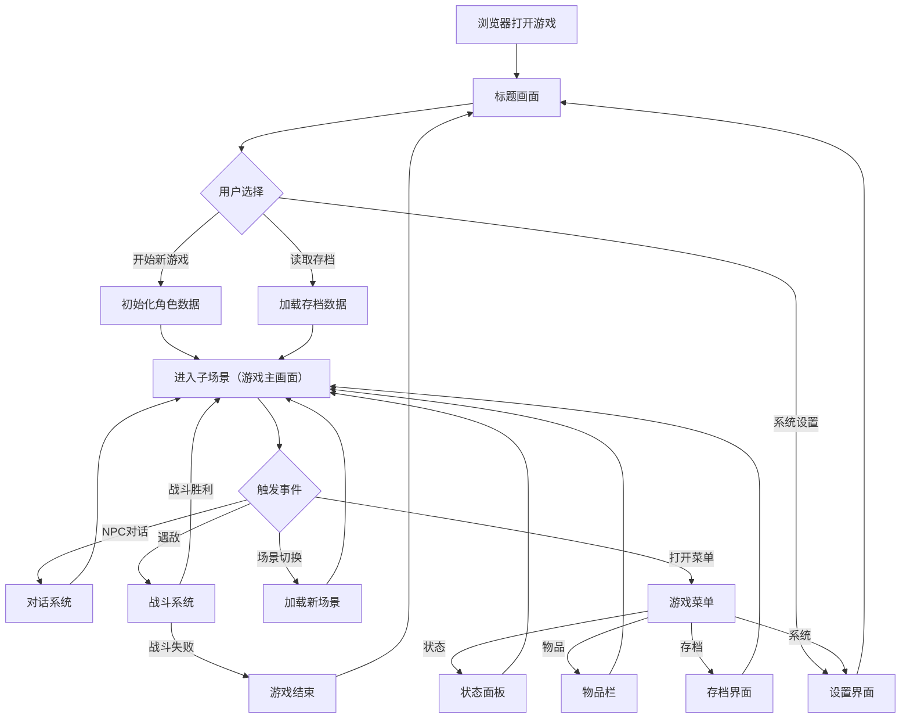

## 1. 产品概述

将 C++ 游戏《金庸群侠传复刻版》(kys-cpp) 以 TypeScript + HTML5 Canvas 完整移植为 Web 版，玩家无需安装即可在浏览器中体验经典武侠 RPG 游戏，支持回合制、半即时、黑帝斯风、只狼风等多种战斗模式。

- **目标用户**：金庸武侠爱好者、怀旧游戏玩家、RPG 爱好者
- **核心价值**：零安装、跨平台（PC/平板/手机浏览器均可运行）、保留原版完整游戏体验

## 2. 核心功能

### 2.1 功能模块

1. **游戏引擎核心**：Canvas 2D 渲染管线、事件输入系统、音频播放、纹理/资源管理、定时与帧率控制
2. **场景图系统（RunNode）**：树形场景管理、生命周期回调、全局绘制栈、事件分发与冒泡
3. **标题/主菜单场景**：游戏启动画面、开始新游戏、读取存档、设置（音量、按键配置）、退出
4. **大地图与子场景**：45° 等距瓦片地图渲染、多层地图（地表/建筑/装饰/事件）、角色移动与寻路、场景切换
5. **角色系统**：角色属性（生命/内力/攻击/防御/轻功等）、装备与物品管理、武学修炼与升级、队伍编成
6. **对话与剧情系统**：NPC 对话、事件触发、剧情推进、任务流程
7. **战斗系统**：回合制战斗、半即时战斗（含行动条）、黑帝斯风格即时动作战斗、只狼风格架势对战、纸片风格战斗
8. **存档系统**：多槽位存档/读档、自动存档、存档导入导出
9. **UI 系统**：菜单导航、状态面板、物品栏、商店交易、系统设置

### 2.2 页面详情

| 场景名称 | 模块名称 | 功能描述 |
|----------|----------|----------|
| 标题场景 | 游戏标题画面 | 显示游戏 Logo 与背景，播放开场动画/音乐，任意键进入主菜单 |
| 主菜单场景 | 菜单导航 | 开始新游戏、读取存档、系统设置、退出游戏的选项列表 |
| 系统设置 | 音视频设置 | 音量调节（BGM/音效）、全屏切换、按键自定义配置 |
| 子场景（游戏主画面）| 地图渲染 | 45° 等距瓦片地图绘制，地表/建筑/装饰/事件多层叠加 |
| 子场景 | 角色控制 | 键盘/鼠标/触屏控制主角移动，与 NPC/物体交互 |
| 子场景 | HUD 信息栏 | 队伍头像、生命内力条、小地图、快捷物品栏 |
| 状态面板 | 角色详情 | 查看角色属性、装备、武学、物品的详细信息 |
| 物品栏 | 物品管理 | 分类浏览物品，使用/装备/丢弃操作 |
| 商店界面 | 交易系统 | 购买/出售物品，价格显示 |
| 战斗场景 | 回合制战斗 | 经典回合制：选择武学/物品/防御，逐回合攻防 |
| 战斗场景 | 半即时战斗 | 行动条驱动，速度影响出手顺序 |
| 战斗场景 | 即时战斗 | 实时移动/攻击/闪避，类似动作游戏的操作 |
| 对话系统 | 对话框 | 多行文本显示、头像、选项分支 |
| 存档界面 | 存档管理 | 多槽位显示（含截图/时间/地点），存档/读档/删除操作 |

## 3. 核心流程

## 4. 用户界面设计

### 4.1 设计风格

- **主题色**：复古羊皮纸金棕色调（主色 `#C8A96E`，背景 `#2B1E10` 深棕），辅以朱砂红 `#C04040` 点缀
- **字体**：标题使用书法风格字体（如隶书变体），正文使用宋体/仿宋，保持古风韵味
- **布局**：游戏画面全屏 Canvas 渲染，UI 面板采用卷轴/画轴风格的浮层面板
- **按钮**：仿古印章/木刻风格的圆角按钮，hover 有轻微浮雕效果
- **色调**：整体偏暖偏暗，模拟古旧画卷质感

### 4.2 页面设计概览

| 场景名称 | 模块名称 | UI 元素 |
|----------|----------|---------|
| 标题场景 | 标题画面 | 全屏背景图（山水画风），居中游戏标题（书法字体），底部闪烁「点击开始」提示 |
| 主菜单 | 菜单列表 | 卷轴式半透明面板居中，竖排菜单项，复古印章按钮，选中项高亮描边 |
| 子场景 | 游戏画面 | 左侧 70% 为等距地图渲染区，右侧 30% 为 HUD 面板 |
| 状态面板 | 角色详情 | 画轴展开动效，左侧角色立绘，右侧属性表格（毛笔字风格数字） |
| 物品栏 | 物品列表 | 网格布局物品图标，分类标签页（装备/秘笈/药品/暗器），选中物品显示详情浮层 |
| 战斗场景 | 战斗画面 | 上方敌人区域，下方我方区域，中间操作菜单，招式动画特效 |
| 对话系统 | 对话框 | 底部仿古书卷轴对话框，逐字显示效果，左侧 NPC 头像 |

### 4.3 响应式适配

- **桌面端优先**：默认 1280×720 基础分辨率，Canvas 等比缩放适配窗口
- **移动端适配**：触屏虚拟摇杆控制移动，UI 面板自适应竖屏布局
- **触摸优化**：按钮热区扩大至 44px 以上，支持双指缩放地图