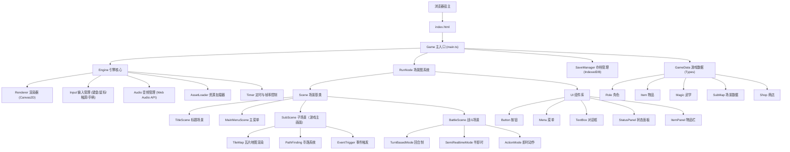
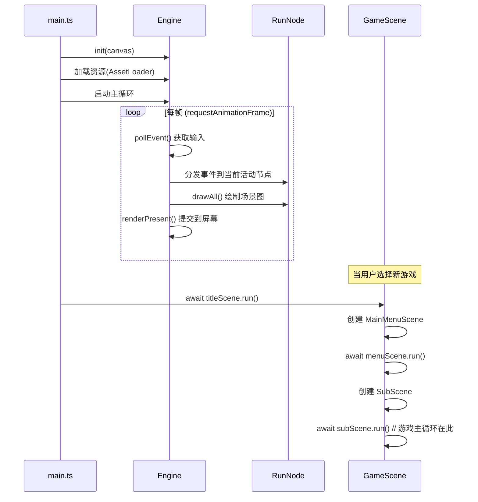
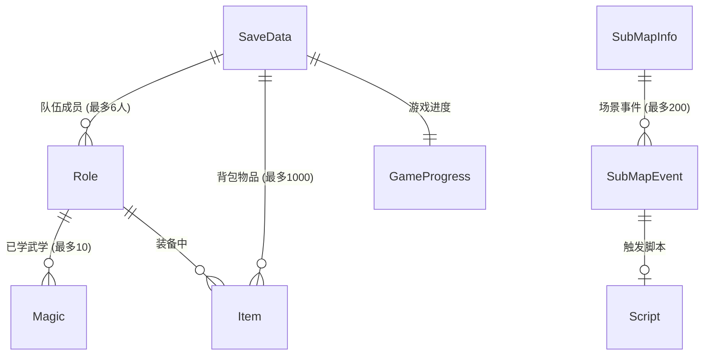

## 1. 架构设计



## 2. 技术选型

- **前端框架**：React@18 + TypeScript
- **构建工具**：Vite
- **样式方案**：Tailwind CSS（仅用于 UI 浮层，游戏画面全部用 Canvas）
- **状态管理**：Zustand
- **渲染引擎**：HTML5 Canvas 2D API（主渲染）+ OffscreenCanvas（离屏渲染优化）
- **音频**：Web Audio API（BGM 长音频）+ HTML5 Audio（短音效）
- **数据持久化**：IndexedDB（存档）+ localStorage（设置）
- **资源格式**：PNG/WebP 图片、JSON 数据文件、OGG/MP3 音频
- **分包策略**：按场景懒加载（标题→主菜单→游戏场景→战斗场景）

## 3. 目录结构

```
kys-web/
├── index.html
├── package.json
├── tsconfig.json
├── vite.config.ts
├── tailwind.config.js
├── postcss.config.js
├── public/
│   └── assets/
│       ├── textures/          # 游戏贴图资源
│       ├── audio/             # 音频资源
│       ├── data/              # 游戏数据文件（JSON）
│       └── fonts/             # 字体文件
├── src/
│   ├── main.tsx               # React 入口
│   ├── App.tsx                # 应用根组件
│   ├── game/
│   │   ├── core/
│   │   │   ├── Engine.ts      # 引擎核心（单例）
│   │   │   ├── Renderer.ts    # Canvas 2D 渲染器封装
│   │   │   ├── Input.ts       # 输入管理
│   │   │   ├── Audio.ts       # 音频管理
│   │   │   ├── AssetLoader.ts # 资源加载器
│   │   │   ├── Timer.ts       # 帧率/时间管理
│   │   │   └── TextureManager.ts  # 纹理管理器
│   │   ├── scene/
│   │   │   ├── RunNode.ts     # 场景节点基类
│   │   │   ├── Scene.ts       # 场景基类（继承 RunNode）
│   │   │   ├── TitleScene.ts  # 标题场景
│   │   │   ├── MainMenuScene.ts   # 主菜单场景
│   │   │   ├── SubScene.ts    # 子场景（游戏主画面）
│   │   │   └── BattleScene.ts # 战斗场景
│   │   ├── battle/
│   │   │   ├── BattleSystem.ts    # 战斗系统基类
│   │   │   ├── TurnBasedMode.ts   # 回合制模式
│   │   │   ├── SemiRealtimeMode.ts # 半即时模式
│   │   │   └── ActionMode.ts      # 即时动作模式
│   │   ├── map/
│   │   │   ├── TileMap.ts     # 瓦片地图渲染
│   │   │   ├── TileCamera.ts  # 地图相机
│   │   │   └── PathFinding.ts # A* 寻路
│   │   ├── data/
│   │   │   ├── Types.ts       # 所有数据类型定义
│   │   │   ├── SaveManager.ts # 存档管理器
│   │   │   ├── GameData.ts    # 游戏数据加载器
│   │   │   └── GameState.ts   # Zustand 全局状态
│   │   ├── ui/
│   │   │   ├── Button.ts      # 按钮组件
│   │   │   ├── Menu.ts        # 菜单组件
│   │   │   ├── TextBox.ts     # 文本框组件
│   │   │   ├── StatusPanel.ts # 状态面板
│   │   │   ├── ItemPanel.ts   # 物品面板
│   │   │   ├── ShopPanel.ts   # 商店面板
│   │   │   └── DialogBox.ts   # 对话框
│   │   └── utils/
│   │       ├── math.ts        # 数学工具（坐标转换等）
│   │       ├── color.ts       # 颜色工具
│   │       └── font.ts        # 字体工具
│   ├── components/
│   │   ├── GameCanvas.tsx     # Canvas React 组件
│   │   ├── LoadingScreen.tsx  # 加载画面
│   │   └── VirtualStick.tsx   # 移动端虚拟摇杆
│   ├── hooks/
│   │   ├── useGameLoop.ts     # 游戏主循环 Hook
│   │   └── useFullscreen.ts   # 全屏 Hook
│   └── pages/
│       └── GamePage.tsx       # 游戏主页面
```

## 4. 核心模块设计

### 4.1 Engine（引擎核心）

对应 C++ `Engine` 单例类，封装 Canvas 渲染、输入、音频三大子系统。

```typescript
// Engine.ts - 引擎核心单例
class Engine {
  private static instance: Engine;
  
  // 渲染相关
  private canvas: HTMLCanvasElement;
  private ctx: CanvasRenderingContext2D;
  private uiWidth: number = 1024;
  private uiHeight: number = 640;
  private ratioX: number = 1;
  private ratioY: number = 1;
  
  // 音频
  private audioContext: AudioContext;
  private audioGain: GainNode;
  
  // 输入状态
  private keyState: Map<string, boolean>;
  private mouseX: number;
  private mouseY: number;
  private mouseButtons: number;
  
  static getInstance(): Engine;
  
  // 渲染 API
  init(canvas: HTMLCanvasElement): void;
  renderClear(): void;
  renderTexture(tex: ImageBitmap, x: number, y: number, w?: number, h?: number): void;
  renderTextureEx(tex: ImageBitmap, src: Rect, dst: Rect, angle?: number): void;
  setRenderTarget(offscreen: OffscreenCanvas | null): void;
  fillColor(color: Color, x: number, y: number, w: number, h: number): void;
  windowToUISpace(wx: number, wy: number): { ux: number; uy: number };
  renderPresent(): void;
  
  // 纹理
  loadImage(path: string): Promise<ImageBitmap>;
  createTextTexture(text: string, size: number, color: Color): ImageBitmap;
  
  // 输入
  pollEvent(): GameEvent | null;
  getKeyState(key: string): boolean;
  getMouseState(): { x: number; y: number; buttons: number };
  
  // 音频
  playBGM(src: string, volume?: number): void;
  playSE(src: string, volume?: number): void;
  stopBGM(): void;
  
  // 时间
  getTicks(): number;
  delay(ms: number): Promise<void>;
}
```

### 4.2 RunNode（场景图系统）

对应 C++ `RunNode`，实现树形场景管理和阻塞式事件循环（使用 async/await 模拟 C++ 的 `run()` 阻塞行为）。

```typescript
// RunNode.ts - 场景节点基类
class RunNode {
  // 全局绘制栈（静态）
  static root: RunNode[];
  static refreshInterval: number;
  
  // 节点属性
  protected children: RunNode[];
  protected visible: boolean = true;
  protected result: number = -1;
  protected fullWindow: number = 0;
  protected exit: boolean = false;
  protected x: number; y: number; w: number; h: number;
  
  // 生命周期
  virtual onEntrance(): void;
  virtual onExit(): void;
  virtual backRun(): void;      // 每帧后台执行
  virtual draw(): void;         // 绘制
  virtual dealEvent(e: GameEvent): void;  // 事件处理
  virtual onPressedOK(): void;
  virtual onPressedCancel(): void;
  
  // 树操作
  addChild<T extends RunNode>(child: T): T;
  removeChild(child: RunNode): void;
  getChild(index: number): RunNode;
  
  // 核心方法 - 异步阻塞式运行
  async run(inRoot: boolean = true): Promise<number> {
    if (inRoot) RunNode.root.push(this);
    this.onEntrance();
    
    return new Promise<number>((resolve) => {
      const loop = () => {
        if (this.exit) {
          this.onExit();
          if (inRoot) RunNode.removeFromDraw(this);
          resolve(this.result);
          return;
        }
        this.backRun();
        this.draw();
        // 事件由 Engine 主循环分发，这里只等待 exit
        requestAnimationFrame(loop);
      };
      requestAnimationFrame(loop);
    });
  }
  
  static drawAll(): void;  // 从 root 栈底部向上绘制所有可见节点
}
```

### 4.3 游戏数据类型（Types.ts）

直接从 C++ 的 `Types.h` 映射为 TypeScript 接口：

```typescript
// Types.ts - 核心数据类型
interface RoleSave {
  ID: number;
  HeadID: number;
  Name: string;
  Nick: string;
  Sexual: number;
  Level: number;
  Exp: number;
  HP: number; MaxHP: number;
  MP: number; MaxMP: number;
  Attack: number; Speed: number; Defence: number;
  Medicine: number; UsePoison: number; Detoxification: number;
  Fist: number; Sword: number; Knife: number; Unusual: number;
  Knowledge: number; Morality: number; Fame: number; IQ: number;
  Equip0: number; Equip1: number;
  MagicID: number[]; MagicLevel: number[];
  TakingItem: number[]; TakingItemCount: number[];
  // ... 其余属性
}

interface Role extends RoleSave {
  Team: number;
  FaceTowards: number;
  Pic: number;
  x: number; y: number;
  // 战斗临时属性
  BattleSpeed: number;
  Progress: number;
  Acted: boolean; Moved: boolean;
  // 即时战斗属性
  Pos: Pointf;
  Velocity: Pointf;
  Posture: number;
  HurtFrame: number;
  // ...
}

interface Item {
  ID: number;
  Name: string;
  Introduction: string;
  ItemType: number;  // 0剧情 1装备 2秘笈 3药品 4暗器
  MagicID: number;
  EquipType: number;
  AddHP: number; AddMaxHP: number;
  AddAttack: number; AddSpeed: number; AddDefence: number;
  // ... 增减属性
}

interface Magic {
  ID: number;
  Name: string;
  MagicType: number;  // 1拳 2剑 3刀 4特殊
  EffectID: number;
  HurtType: number;
  AttackAreaType: number;  // 0点 1线 2十字 3面
  NeedMP: number;
  Attack: number[];
  SelectDistance: number[];
  AttackDistance: number[];
  SoundID: number;
}

interface SubMapInfo {
  ID: number;
  Name: string;
  EntranceX: number; EntranceY: number;
  ExitX: number[]; ExitY: number[];
  // 6层地图数据
  Earth: Int16Array;        // 地表
  Building: Int16Array;     // 建筑
  Decoration: Int16Array;   // 装饰
  EventIndex: Int16Array;   // 事件索引
  BuildingHeight: Int16Array;
  DecorationHeight: Int16Array;
  Events: SubMapEvent[];
}
```

### 4.4 存档系统（SaveManager）

使用 IndexedDB 存储，支持多槽位（5-10 个）、自动存档功能。

```typescript
// SaveManager.ts
class SaveManager {
  static readonly SLOT_COUNT = 10;
  
  static async save(slot: number, data: SaveData): Promise<void>;
  static async load(slot: number): Promise<SaveData | null>;
  static async delete(slot: number): Promise<void>;
  static async getSlotInfo(slot: number): Promise<SlotInfo>;
  static async exportSave(slot: number): Promise<Blob>;
  static async importSave(file: File): Promise<void>;
}
```

### 4.5 瓦片地图渲染（TileMap）

45° 等距视角渲染管线，支持 6 层地图数据叠加绘制。

```typescript
// TileMap.ts
class TileMap {
  private textures: ImageBitmap[];  // 瓦片纹理集
  private camera: TileCamera;
  
  // 等距坐标转换（屏幕坐标 ↔ 地图坐标）
  static toScreenCoord(mapX: number, mapY: number): { sx: number; sy: number };
  static toMapCoord(screenX: number, screenY: number): { mx: number; my: number };
  
  // 渲染视野内的地图
  render(subMap: SubMapInfo, viewX: number, viewY: number): void;
  
  // 分层绘制
  private renderLayer(data: Int16Array, layerType: number): void;
  
  // 建筑遮挡排序
  private sortByDepth(): void;
}
```

## 5. 游戏主循环流程



## 6. 数据模型

### 6.1 核心实体关系



### 6.2 存档数据结构

```typescript
interface SaveData {
  version: number;
  timestamp: number;
  slotName: string;
  
  // 队伍
  teamRoles: RoleSave[];       // 队伍角色（最多6人）
  allRoles: RoleSave[];        // 所有角色数据
  
  // 物品
  items: ItemSave[];           // 背包物品
  
  // 进度
  currentSubMap: number;       // 当前所在场景ID
  playerX: number;             // 主角坐标
  playerY: number;
  eventFlags: Uint8Array;      // 事件完成标记
  visitedMaps: number[];       // 已访问场景列表
  
  // 设置
  settings: GameSettings;
}
```

## 7. 实现阶段规划

### 第一阶段：核心引擎（MVP）
1. Engine 核心 + Canvas 渲染管线
2. RunNode 场景图系统
3. 输入管理（键盘/鼠标）
4. 资源加载器
5. 标题场景 + 主菜单场景（不含游戏内容）

### 第二阶段：游戏核心
6. 等距瓦片地图渲染
7. 子场景（地图移动、场景切换）
8. 角色系统与物品系统
9. 对话系统
10. 存档系统

### 第三阶段：战斗与完善
11. 回合制战斗系统
12. 半即时/即时战斗系统
13. UI 面板（状态/物品/商店/设置）
14. 音频系统
15. 移动端适配